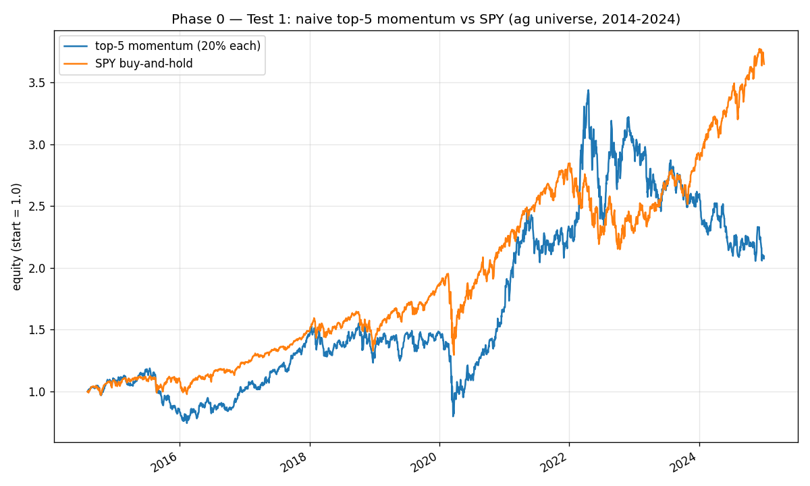

# Phase 0 — Test 1: Naive top-5 momentum baseline

**Run date:** 2026-04-22
**Universe:** NTR, MOS, CF, CTVA, FMC, ADM, BG, DE, AGCO, CNH (n=10); benchmark SPY
**Window:** 2014-01-01 → 2025-01-01 (exclusive end)
**Rule:** hold top-5 by trailing 126-day return at 20% each; rebalance monthly; 5 bps/side cost.

## Verdict

- **Outcome: FAIL**
- Sharpe criterion (≥ SPY + 0.2): ❌  (0.406 vs SPY 0.802, Δ=-0.396)
- Regime criterion (≥ 3/4 beat SPY on CAGR): ❌  (1/4)

## Full-period summary

| Metric | Portfolio | SPY |
|---|---:|---:|
| Annualized Sharpe | 0.406 | 0.802 |
| CAGR | 7.36% | 13.25% |
| Max drawdown | -48.73% | -33.72% |

## Regime breakdown (CAGR)

| Period | Portfolio | SPY | Excess | Beats SPY |
|---|---:|---:|---:|:--:|
| 2014-2016 commodity bust (2014-01-01→2016-12-31) | 0.25% | 8.53% | -8.28% | ❌ |
| 2017-2019 stable (2017-01-01→2019-12-31) | 13.51% | 15.12% | -1.61% | ❌ |
| 2020-2021 pandemic+infl. (2020-01-01→2021-12-31) | 25.24% | 23.37% | +1.87% | ✅ |
| 2022-2024 rates+Ukraine (2022-01-01→2024-12-31) | -3.20% | 8.88% | -12.08% | ❌ |

## Equity curve

## Caveats

- **Survivorship bias:** the 10 equities were chosen in 2026, applied to 2014. 
  Reported result is ex-post on a universe picked with foreknowledge of which names 
  still traded. Sensitivity to dropping the two most ex-post-obvious picks not yet run.
- **CTVA gap:** Corteva spun from DowDuPont 2019-06-03. Pre-spin rows are NaN; 
  the selector simply picks from the n<10 tickers available in those months.
- **Costs:** 5 bps/side is conservative-to-realistic for large-cap ag at retail-scale 
  commissions. Slippage is implicit (buy-at-close assumed to fill flat).
- **yfinance adj close:** dividend and split adjusted; survivorship-free for bars that exist.

## Interpretation (per phase0_testing.md §1.5)

**Fail.** No inherent structural tilt in this universe. All alpha must come from active security selection. Raises the bar for everything else and is a strong signal the universe is wrong.
